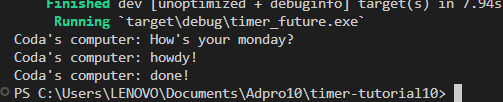

Terlihat bahwa pesan `How's your monday` diesekusi terlebih dahulu. Hal ini disebabkan karena println `How's your monday` terdapat di luar function sehingga saat tugas `async`
dihasilkan, pesan `How's your monday` langsung diesekusi sebelum async dikarenakan async membutuhkan waktu untuk menyelesaikan tugasnya.