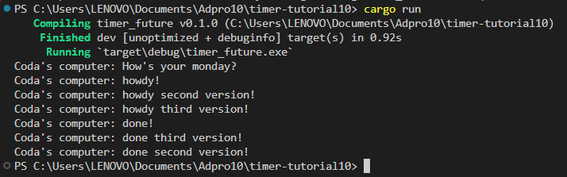
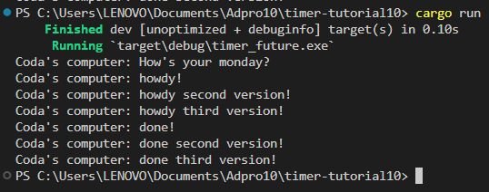
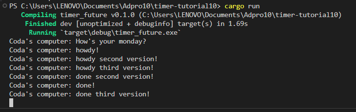

Terlihat bahwa pesan `How's your monday` diesekusi terlebih dahulu. Hal ini disebabkan karena println `How's your monday` terdapat di luar function sehingga saat tugas `async`
dihasilkan, pesan `How's your monday` langsung diesekusi sebelum async dikarenakan async membutuhkan waktu untuk menyelesaikan tugasnya.

Pemanggilan async secara berkala akan mengakibatkan tugas `asynchronous` dijalankan. Penugasan ini akan dilakukan secara queue. Akan tetapi, keluaran program tidak akan selamanya sama karna dilakukan secara kongruen. Dapat dilihat pada 2 foto sebelumnya.

Penghapusan drop mengakibatkan program berjalan terus menerus (tidak selesai) dan menunggu tugas baru yang akan diinput pada queue.

